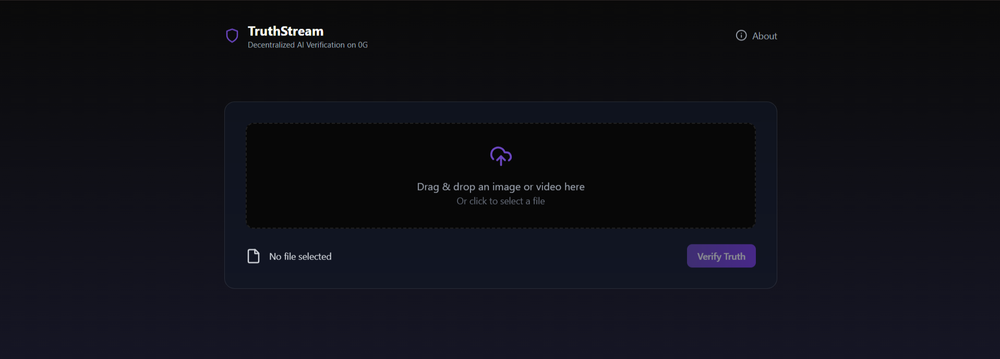
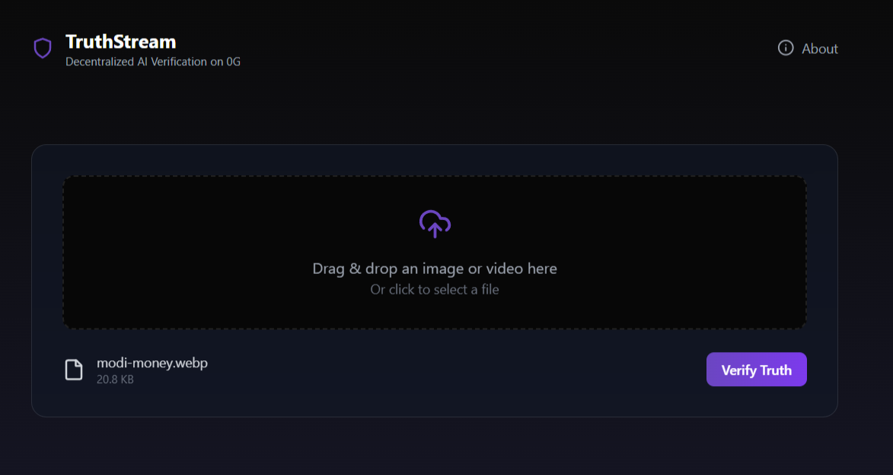
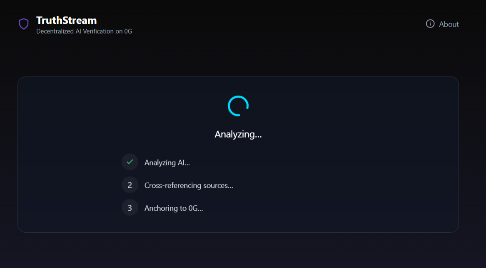
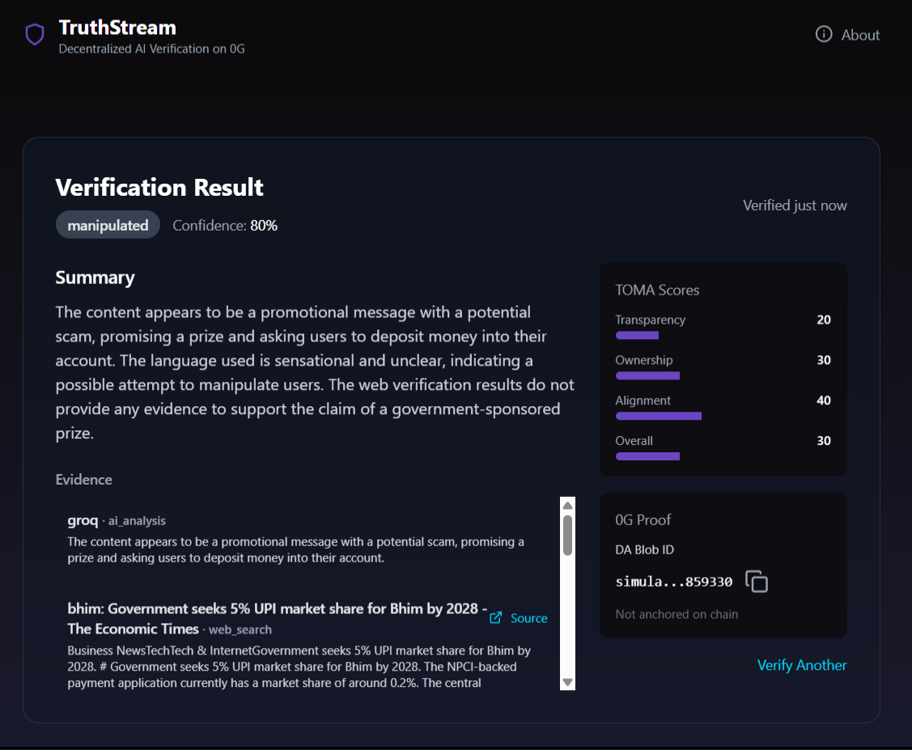
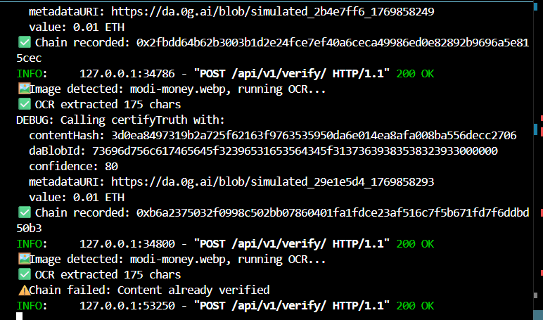
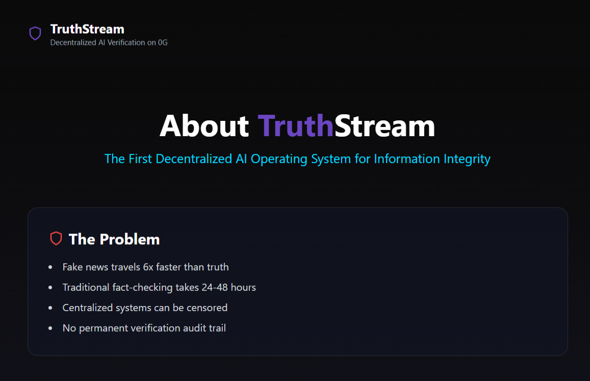

# TruthStream

**Real-time AI fact-checking anchored to 0G’s 50 Gbps Data Availability layer — proving authenticity before misinformation spreads.**

---

## 1. Project Overview

**TruthStream** is a decentralized, AI-powered verification layer that investigates digital content in real time and permanently anchors the results to 0G’s high-throughput Data Availability (DA) network.

In under **2 seconds**, TruthStream produces a cryptographically verifiable **Truth Certificate** that outlives deleted posts, censored servers, and rewritten narratives.

---

## 2. Problem → Solution

### The Problem

Misinformation spreads faster than traditional verification can react.
Deepfakes and manipulated media can reach millions within hours, while existing fact-checking workflows take **24–48 hours**, are centralized, and leave no immutable audit trail.

### The Solution

TruthStream combines:

* **Parallel AI investigation** (claim extraction, web cross-reference, synthesis)
* **0G’s 50 Gbps Data Availability layer** for permanent, censorship-resistant records
* **Economic incentives** to align verifiers toward accuracy

Each verification produces an immutable on-chain reference backed by transparent evidence and stake-based accountability.

---

## 3. Who It’s For

* **Journalists & Fact-Checkers** — verify viral content during breaking news
* **Social Media Users** — validate images or videos before resharing
* **Newsrooms & Platforms** — embed transparent verification into workflows
* **Developers (DeFAI / Web3)** — consume verifiable, on-chain truth signals

---

## 4. Key Features

* ⚡ **Sub-5s Verification** — AI analysis + 0G DA anchoring faster than a tweet loads
* 🔗 **0G-Native Architecture** — built specifically for 0G’s DA + EVM stack
* 🧠 **Multi-AI Fallback** — Claude 3.5, Groq, OpenRouter for resilience and uptime
* 🔍 **Transparent Investigation Trail** — open evidence chain for every verdict
* 🛡️ **TOMA Scoring Framework** — Transparency, Ownership, Monetization, Alignment
* 💰 **Stake-to-Verify** — economic guarantees with challenge/slashing mechanics
* 🌐 **Zero-API-Key Fallbacks** — DuckDuckGo ensures baseline functionality
* 🎭 **Multi-Modal** — image, video, and text verification
* 🧩 **Browser Extension** — verify content directly on X/Twitter or WhatsApp Web
* 📱 **Responsive UI** — mobile, tablet, and desktop ready

---

## 5. Demo

* **Live Demo:** `truthstream.vercel.app` 
* **Demo Video:** 2-Second Verification Flow
* **0G Explorer:** Sample verification transaction

**Flow:** Upload → AI investigation → 0G DA anchoring → Shareable Truth Certificate

### Landing page 

 
### Upload the file(img, vid or txt)
 

### Analysis
 

### Results 
 

### Chain details(tx)
 

### About TruthStream

---

## 6. High-Level Architecture

1. Content is hashed (SHA-256) client-side
2. AI agents extract claims and cross-reference live web sources
3. TOMA score and investigation report are generated
4. Investigation data is published to **0G Data Availability**
5. Smart contract records verification proof on 0G Chain
6. User receives a shareable, immutable Truth Certificate

---

## 7. Why 0G

TruthStream is only viable because of 0G’s architecture:

* **50 Gbps DA throughput** enables real-time anchoring
* **Low cost per blob** makes frequent verification economically feasible
* **Modular design** cleanly separates computation from permanence

Without 0G, real-time, public AI verification would be prohibitively slow or expensive.

---

## 8. Status

* **Hackathon MVP:** Complete
* **Network:** 0G Galileo Testnet
* **Scope:** End-to-end verification flow with staking and DA anchoring

---

## 9. License

MIT License © 2026 TruthStream Contributors

---

## 10. Acknowledgments

Built during the **0G Bangalore Hackathon**.
Powered by **0G Labs**, **Anthropic (Claude 3.5)**, **Groq**, **Tavily**, and open-source tooling across FastAPI, Vite, Web3.py, and Ethers.js.

---
