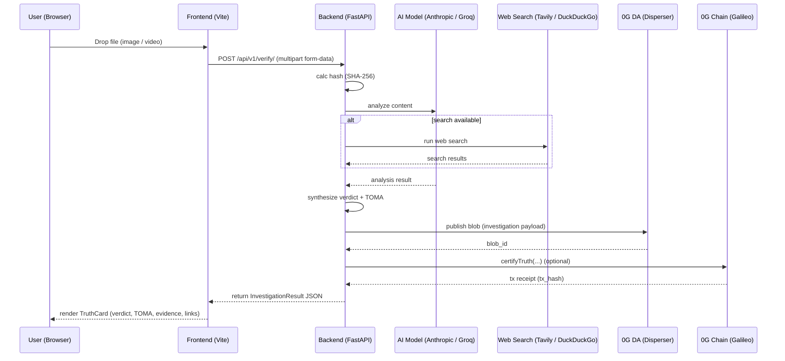

# User Flow & Data Lifecycle 🔁

## Overview
This document maps the end-to-end user journey when someone uses the TruthStream frontend to verify content. It includes approximate timing estimates for each backend step to help guide UX expectations and demo pacing.

---

## Quick steps
1. User visits frontend: `http://localhost:5173` ✅
2. User drags or selects an image/video in the Upload zone 📁
3. Frontend sends POST `http://localhost:8000/api/v1/verify/` with `FormData` field `file` (multipart/form-data)
4. Backend returns `InvestigationResult` JSON; frontend renders `TruthCard` with verdict, TOMA scores, summary, evidence chain, DA blob id and `tx_hash` if anchored.

---

## Backend processing timeline (approximate)
- Calculate file hash (SHA-256): ~100 ms 💨
- OCR / text extraction (if image): ~500 ms (varies with image complexity) 🖼️
- AI analysis (model inference, analysis): 2-3 s ⚙️
- Web search (if enabled): 1-2 s 🌐
- Synthesis + TOMA scoring: ~100 ms ✨
- Publish to 0G DA (upload blob): ~0.5–1 s 🗂️
- Chain anchoring (optional): 2–3 s (depends on network & confirmations) ⛓️

> Typical end-to-end demo latency: ~3–6 seconds 

---

## High-level flow (Mermaid)

---

## Frontend UX notes
- Loading state is shown for at least 3s to display multi-step progress (Analyzing → Cross-referencing → Anchoring). 🔄
- If DA upload or chain recording fails, the investigation still returns a verdict; DA/tx fields may be empty. ⚠️
- Blockchain actions are optional and gated behind environment variables (`OG_PRIVATE_KEY`, `CONTRACT_ADDRESS`). 🔐

---

## Demo checklist ✅
- Backend running: `cd packages/api && make run` (http://localhost:8000)
- Frontend running: `cd frontend && npm install && npm run dev` (http://localhost:5173)
- Ensure CORS: The Vite dev server proxies `/api` to the backend by default. If you run frontend without the proxy, add `http://127.0.0.1:5173` to backend CORS or use `allow_origins=['*']` in development.

---
